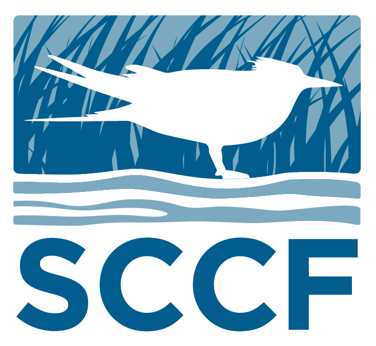
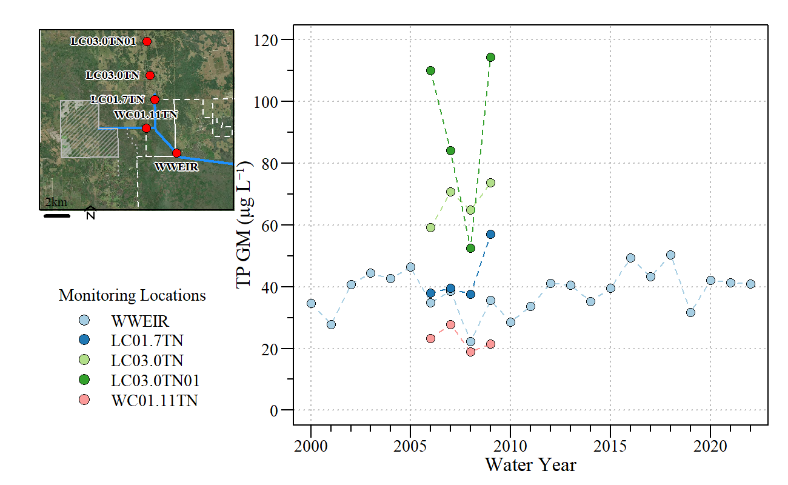
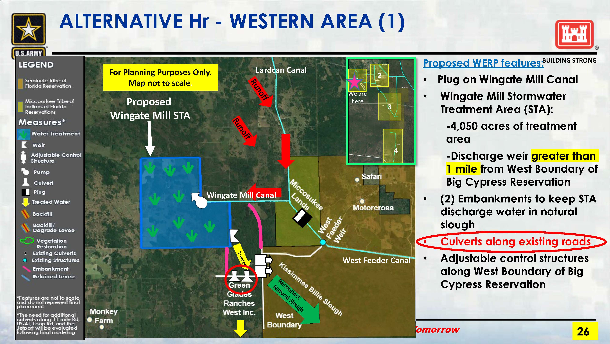
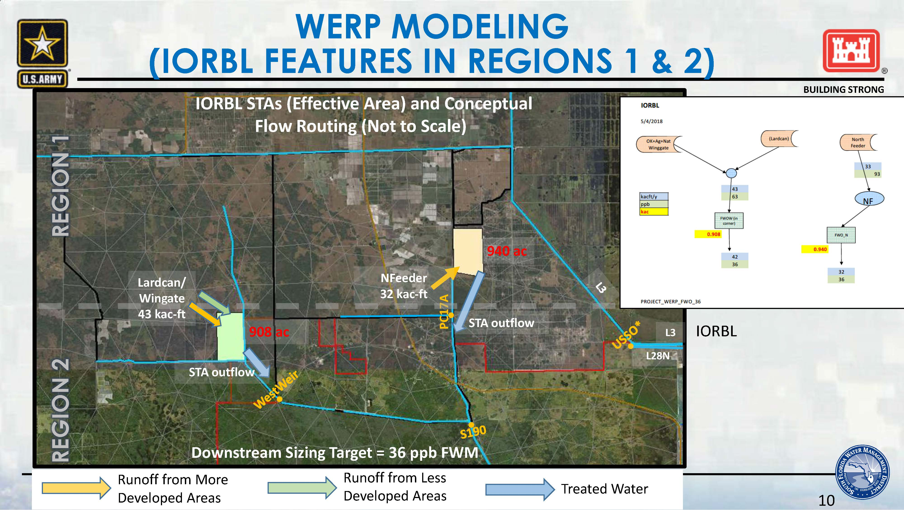
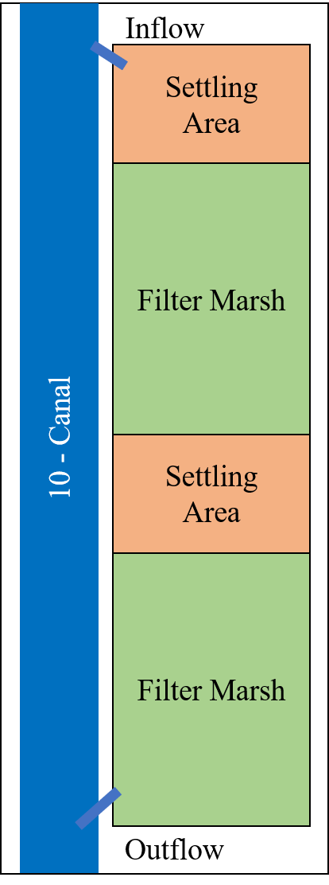
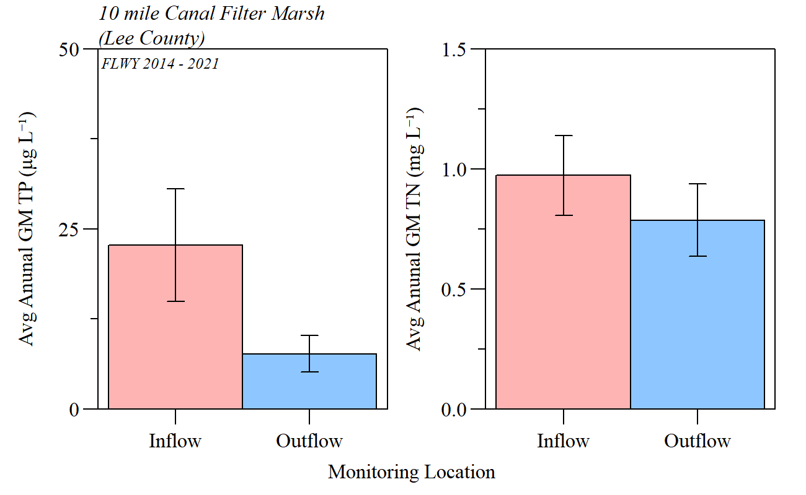

```{r xaringanExtra, include=FALSE, warnint=FALSE}
# devtools::install_github("gadenbuie/xaringanExtra")
# xaringanExtra::use_webcam()
xaringanExtra::use_tile_view()
# xaringanExtra::use_scribble()
# xaringanExtra::use_progress_bar("red", "bottom","0.25em")
```

```{r setup, include=FALSE}
library(knitr)

options(htmltools.dir.version = FALSE)
knitr::opts_chunk$set(warning = FALSE, message = FALSE, echo=FALSE)

##
library(flextable)
library(magrittr)
library(plyr)
library(reshape2)

wd="C:/Julian_LaCie/_Github/WERP_WQ"

plot.path=paste0(wd,"/Plots/")
export.path=paste0(wd,"/Export/")

plot.figs=list.files(plot.path,full.names=T)

slides.figs=paste0(wd,"/slides/plots/")
file.copy(plot.figs,slides.figs,overwrite=T,recursive=T)

```

layout: true

<div class="my-footer">
<span>  </span>
</div>

---
name: title
class: left, middle

### Western Everglades Restoration Project


.pull-left[
#### Virtual Project Delivery Team Meeting and Listening Session

*Sanibel-Captiva Conservation Foundation*

*Conservancy of Southwest Florida*

`r paste(format(as.Date("2022-12-09"),"%B %d, %Y"))#,"<br>(Updated:", format(as.Date(Sys.Date()),"%B %d, %Y"),")")`

]
<!-- this ends up being the title slide since seal = FALSE-->
  
.pull-right[
```{r ,fig.align="center",out.width="40%"}
    
```
    
```{r ,fig.align="center",out.width="40%"}
    knitr::include_graphics('./ConSWFL.jpeg')
```
    
]

.footnote[
Paul Julian PhD<br>[`r fontawesome::fa("fas fa-envelope")`](mailto: pjulian@sccf.org) .small[pjulian@sccf.org]

.small[Use cursor keys for navigation, press .red["O"] for a slide .red[O]verview]

```{r} 
bsplus::bs_button(
    label = "Download PDF Version",
    button_type = "primary",
    button_size = "small") %>%
    htmltools::a(
      href = "https://sccf-tech.github.io/WERP_WQ/slides/20230117_WERP_Listening.pdf"
      )
```
]

---
name: WFEEDERWQ

### West Feeder WQ Information

```{r,out.width="75%",fig.align="center",fig.cap="Annual (FLWY) Geometric Mean TP concentrations." }


```

* Since 2008 WWEIR AGM Concentrations have been significantly increasing ( $\tau$=0.41; $\rho$-value<0.05).
* Based on limited data Wingate Canal Concentrations < Lard can Canal.
* Lard Can AGM TP concentrations increase from south to north (based on limited data).

---
name: WFEEDERWQ

### Downstream WQ Limits

* As detailed in *"Numeric Interpretation of Narrative Standards for the L-28 Interceptor Canal and Big Cypress National Preserve."* <sup>1</sup> a numeric interpretation of the narrative water quality standard was developed for WERP to be protective of the downstream OFW (Big Cypress National Preserve).

```{r}
data.frame(time=c("Long Term","Annual"),TP=c(13,21),TN=c(1.00,1.24))%>%
  flextable()%>%
  compose(j="time",i=~time=="Long Term",value=as_paragraph('Long-term (5-Year)'))%>%
  set_header_labels("time"=" ",
                    "TP" = "Total\nPhosphorus\n(\u03BCg L\u207B\u00B9)",
                    "TN" = "Total\nNitrogen\n(mg L\u207B\u00B9)")%>%
  width(width=c(1.5,0.75,0.75))%>%
  align(j=1,align="left",part="all")%>%
  valign(j=1:3,valign="middle")%>%
  align(j=2:3,align="center",part="all")%>%
  padding(padding=1.5,part="all")%>%
  font(fontname="Times New Roman",part="all")%>%
  fontsize(size=11,part="all")%>%
  fontsize(size=12,part="header")%>%
  footnote(j=1,i=1,ref_symbols = " 1 ",part="body",
           value=as_paragraph("Long Term = Five (5) Florida Water Years (May - April)."),inline=T)%>%
  footnote(j=1,i=1,ref_symbols = " ",part="body",
           value=as_paragraph("Average geomtric mean concentraion."),inline=T)

```


Therefore, some level of treatment is needed to improve water quality in the Wingate-Lard Can-West Feeder Canal system.

.small[
.footnote[
<sup>1</sup> FDEP, 2017, Numeric Interpretation of Narrative Standards for the L-28 Interceptor Canal and Big Cypress National Preserve. Tallahassee, FL. [LINK to Document](https://sccf-tech.github.io/WERP_WQ/slides/FDEP WERP WQ WhitePaper_FINAL 071117.pdf)
]
]


---
name: Treat2

### Current WQ treatment Projects
.pull-left[
* Land and sizing issues with current proposed Wingate Mill STA. 
  * Current stakeholder concerns
  * Concerns regarding ability to effectively operate (maintain target stages).
]

.pull-right[
```{r,out.width="100%",fig.align="center",fig.cap="From 28 Feb 2022 PDT" }


```
]

--

.pull-left[
* FWO Wingate/Lardcan STA?
  * 908 Acres
  * Sized to achieve L-28 Interceptor Canal baseline concentrations

]
.pull-right[
```{r,out.width="100%",fig.align="center",fig.cap="From 21 Sept 2020 PDT" }


```
]


---
name: Treat2

### Conceptual WQ treatment projects

#### Improved/Advanced BMPs 

* **Low hanging fruit**, implement watershed/basin BMPs
  * Include Canal cleaning and improvement
   
* Identify areas of concern (i.e. old culverts) and implement site specific nutrient and sediment reduction BMPs.
  * Proof of concept - EAA BMP program
  
<br>

.pull-left[
<center><b>Pros</b></center>

* Cost effective
* Leverage state funding programs for BMP development and implementation

]

.pull-right[
<center><b>Cons</b></center>

* Willing participation
* Not going to provide complete level of treatment needed (additional projects needed)


]


---
name: Treat2

### Conceptual WQ treatment projects

#### Concept #1 - Filter marsh

* Lard Can and Wingate Mill canal filter marsh(es)
  * Utilize land next to canals to build a filter marsh (long linear STA) along the canal.
  * Provide WQ treatment with minimal land 
  * Utilized in urban environments - Example Lee County Florida, 10-Mile Canal.

* Lard Can canal filter marsh 
  * ~ 2.4 km (~1.5 mi) between junction to Roberts/Sherrods property boundry gate

* Wingate Mill canal filter marsh
  * ~ 2.6 km (~1.6 mi) between junction to WC034TN (Inactive WQ site).

---
name: Treat2

### Conceptual WQ treatment projects
.pull-left[

* 10-Mile Canal Filter Marsh
  * ~2 km (~1.21 mi) long project
  * ~30 meters (~ 100 ft) wide 
  * Over the last 9 years 66% and ~20% reduction in TP and TN, respectively (based on annual GM Conc.)

]

.pull-right[
```{r,out.width="45%",fig.align="center",fig.cap="Generalized diagram of 10-mile Canal filter marsh" }


```

]

---
name: Treat2

### Conceptual WQ treatment projects
.pull-left[

* 10-Mile Canal Filter Marsh
  * ~2 km (~1.21 mi) long project
  * ~30 meters (~ 100 ft) wide 
  * Over the last 9 years 66% and ~20% reduction in TP and TN, respectively (based on annual GM Conc.)
  
```{r,out.width="100%",fig.align="center",fig.cap="Avg GM concs WYs 2014 - 2022" }


```

]

.pull-right[
```{r,out.width="45%",fig.align="center",fig.cap="Generalized diagram of 10-mile Canal filter marsh" }


```

]

---
name: Treat2

### Conceptual WQ treatment projects

#### Concept #1 - Filter marsh

```{r, include=F}
LC.l=2.4
LC.w=0.06

LC.a.acres=LC.l*LC.w*247.105

WG.l=2.6
WG.w=0.06

WG.a.acres=WG.l*WG.w*247.105

LC.a.acres+WG.a.acres
```

.pull-left[
<center><b>Pros</b></center>

* Smaller footprint
* If 60 meters wide (~164 ft) total area ~74 acres
* less intrusive than Wingate Mill STA
* Provides some level of treatment

]

.pull-right[
<center><b>Cons</b></center>

* Not going to provide complete level of treatment needed
* Some management is needed (maintenance and monitoring)
* Additional infrastructure (gates on canal for diversions if needed)
* Still requires land

]


---
name: Treat2

### Conceptual WQ treatment projects

#### Concept #2 - Hybrid Wetland Treatment

* Combine chemical and wetland treatment to reduce nutrients
  * Utilized flocculents such as Alum, Polyaluminium chloride (PAC), Ferrous Chloride to reduce nutrient concentrations
  * Wetland treatment to provide additional treatment prior to discharge
  * Proof of Concept - Grassy Island HWTT and Lemkin Creek/Wolff Ditch HWTT
  
* Based on evaluation of past and ongoing pilot projects, recommend larger wetland features to improve treatment


.pull-left[
<center><b>Pros</b></center>

* Smaller footprint when compared to traditional STAs
* Potential for high level of treatment efficiency

]

.pull-right[
<center><b>Cons</b></center>
.small[
* Costly to run (i.e. pumps, flocculent, etc) and maintain (i.e. drying and disposal of flocculent material)
* Must understand water chemistry to optimize treatment without exporting flocculent material (i.e. sulfate, aluminum, etc.)
* Regional concern regarding mercury methylation (and other ecological and biogeochemical effects) due to increases sulfate load
* If treatment is not optimized, particulate aluminum (if Alum is used) can be discharged and cause downstream pH specific toxicity concerns
* Arsenic accumulation in biotia
* Still requires land

]
]